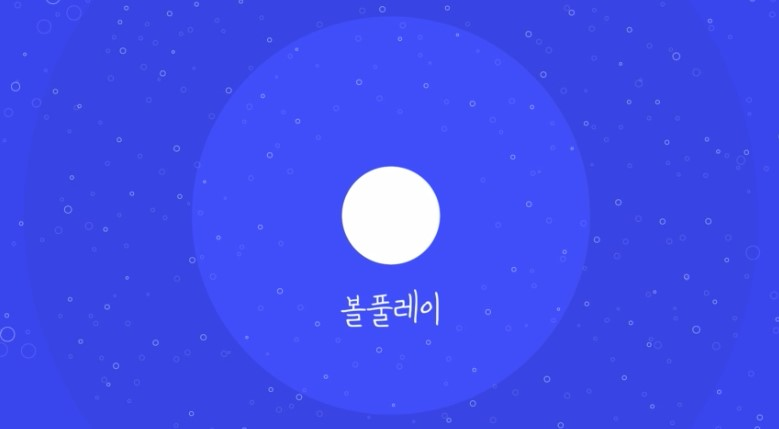

## Ballplaying - Interactive Game
- 기간 : 2018-09-03 ~ 2018-12-14

  - 성과 : 교내 SW 프로젝트 대회 최우수상 수상
  - 개요 : 프로젝터로 벽면에 타겟을 투영하고 볼풀공을 던져 맞추는 게임
  - 내용 : 사용자가 던진 공의 위치를 Depth 카메라에서 벽면 상 좌표 값으로 인식, Processing과 C#의 통신을 통해 볼의 좌표 값 송수신, 전달된 볼의 좌표 값과 타겟 객체의 충돌 처리로 진행되는 인터렉티브 게임 제작
  - 역할 : C# 프로그래밍으로 Unity 조작, 타겟 생성과 삭제 관련 이벤트 처리 구현
  - 개발 언어, 환경 및 모델 : Processing, C# / Processing, Unity / KinectPV2

    

## Video

(아래 이미지를 클릭하면, 홍보 영상을 보실 수 있습니다.)

## Demo

## 참고
프로젝트에 대한 자세한 내용은 [기획서](https://github.com/Hongiee2/BallPlaying-Capstone/blob/master/%EA%B8%B0%ED%9A%8D%EC%84%9C.pptx) / [상위설계서](https://github.com/Hongiee2/BallPlaying-Capstone/blob/master/%EC%83%81%EC%9C%84%EC%84%A4%EA%B3%84%EC%84%9C.docx) / [요구정의서](https://github.com/Hongiee2/BallPlaying-Capstone/blob/master/%EC%A0%9C%EC%95%88%20%EB%B0%8F%20%EC%9A%94%EA%B5%AC%EC%A0%95%EC%9D%98%EC%84%9C.docx)에 기록해두었습니다.

