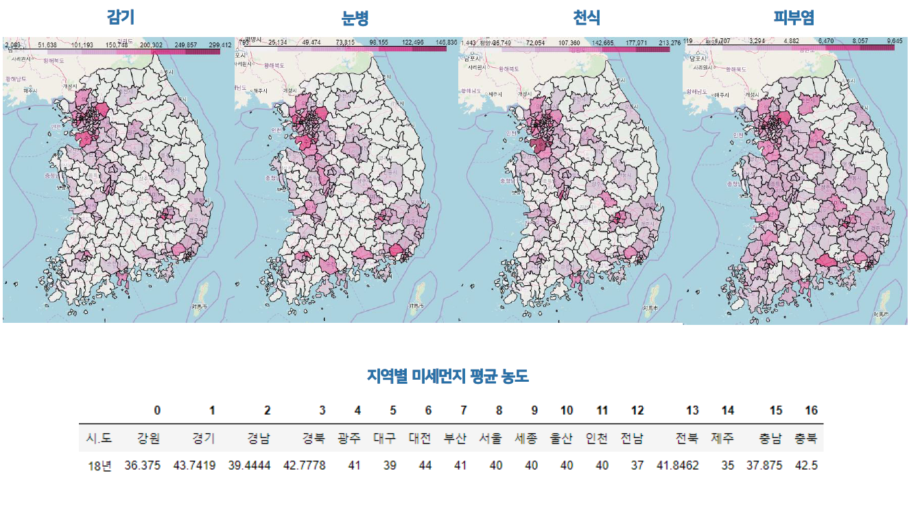
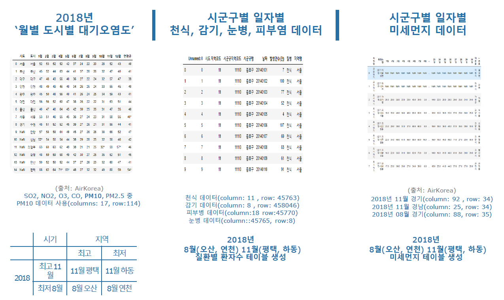
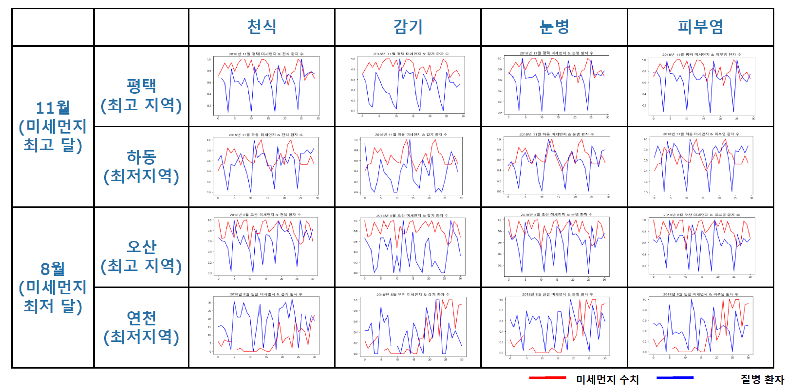
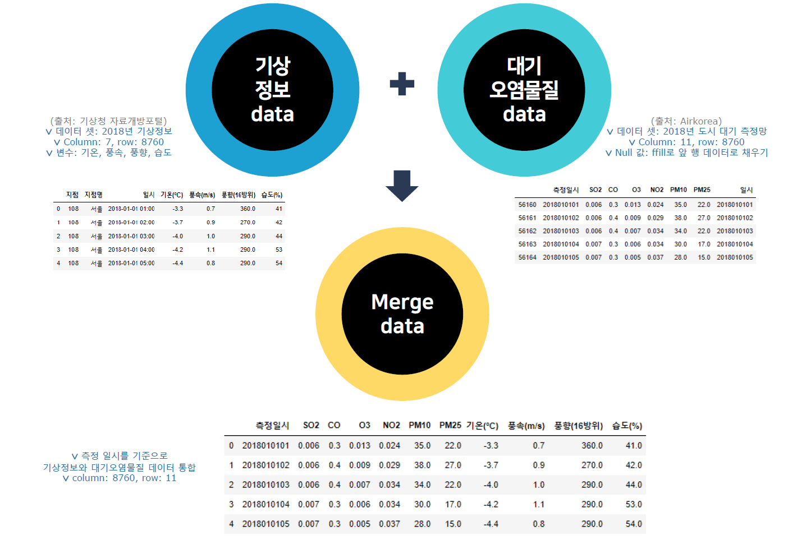

# 통합 대기칠 예측 머신러닝&딥러닝 모델

**(Rating Air Quality  based on ML&DL Model)**

이 프로젝트는 기상정보와 대기오염물질 분석을 통한 대기질 예측 딥러닝&머신러닝 모델을 구축하는 목표입니다.

미세먼지가 심해져서 마스크를 벗을 수 없는 일상 속에 살아가는 우리 모습입니다.

미세먼지가 <u>우리 건강에 어떤 영향을 주는지</u> 확인해보고 싶었고, 실제로 <u>미세먼지 수치와 질병의 상관관계</u>를 파악해볼 수 있지 않을까 하는 가설을 세웠습니다.

지역별 미세먼지의 평균 농도는 아래 표에서 확인할 수 있습니다. 그리고 감기, 눈병, 천식, 피부염의 발생 수는 위에 지도로 시각화 했습니다. 하지만, 위 시각화는 인구수 대비 발병으로 표현한 것이 아니라 절대적인 인구수가 많은 도시에 색이 짙게 나오는 것입니다. 따라서 위 시각화만으로는 유의미한 관계는 찾을 수 없다고 생각했습니다.

따라서 '월별, 도시별 대기 오염도' 데이터 + '시군구별, 일자별 천식/감시/눈병/피부염' 데이터 + '시군구별, 일자별 미세먼지' 데이터를 결합했습니다. 이후 위 데이터를 월 단위로 나눠서 각 데이터 별 최고/최저 시점의 일치성을 확인해봤습니다.

위 시각화 결과를 보면 미세먼지가 천식, 감기, 눈병, 피부염에 영향을 주는 경향도 있지만, 8월 연천지역은 미세먼지가 각 질환에 영향을 주지 않는 것을 볼 수 있습니다.

즉, 최초 가설이었던 **<u>"미세먼지 수치와 질병의 유의미한 관계는 찾기 어렵다"</u>**고 판단했습니다.

박혜경 교수님(부산대학교 의학전문대학원 내과학교실)의 논문 [대기오염과 기후 변화 : 천식에 미치는 영향]을 보면, 천식에 영향을 주는 대기물질은 미세먼지, 오존(O3), 질소산화물(NO2), 이산화항(SO2) 등 이라고 합니다.

그래서 프로젝트 목표를 위한 데이터를 위와 같이 선정했습니다. 기상청에서 제공하는 '기상 정보'와 에어코리아가 제공하는 '대기 오염 물질' 데이터를 결합해서 통합 대기질 분석용 Data Set을 사용했습니다.
