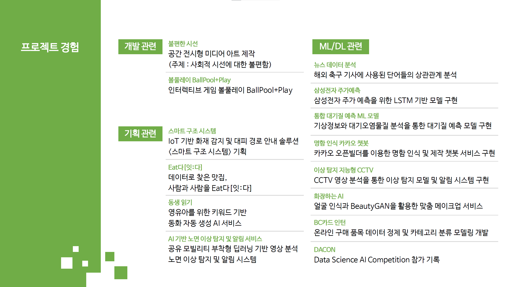

# 프로젝트 경험

**Project Experience**

### [개발]

##### 1) 불편한 시선

- 사회적 시선에 대한 불편함을 주제로 한 공간 전시형 미디어 아트 제작
- <a href="https://github.com/HandeulLy/project/tree/master/Uncomfortable_Eyes">Link</a>

##### 2) BallPoolay

- 인터렉티브 게임 제작
- <a href="https://github.com/HandeulLy/project/tree/master/BallPlaying">Link</a>

### [기획]

### [ML&DL]

##### 1) 통합 대기질 예측 모델

- 기상정보와 대기오염물질 데이터 분석을 통한 대기질 예측 모델 구현
- <a href="https://github.com/HandeulLy/project/tree/master/Fine_Dust_ML">Link</a>

##### 2) 이상 탐지 지능형 CCTV

- YoloV3 기반 CCTV 영상 분석을 통한 폭행 탐지 모델 구현
- <a href="https://github.com/HandeulLy/project/tree/master/CCTV_Anormaly_Detection">Link</a>

##### 3) 화장하는 AI

- 얼굴 인식과 BeautyGAN 모델을 활용한 맞춤 메이크업 서비스

- <a href="https://github.com/HandeulLy/project/tree/master/BeautyGAN">Link</a>

  
