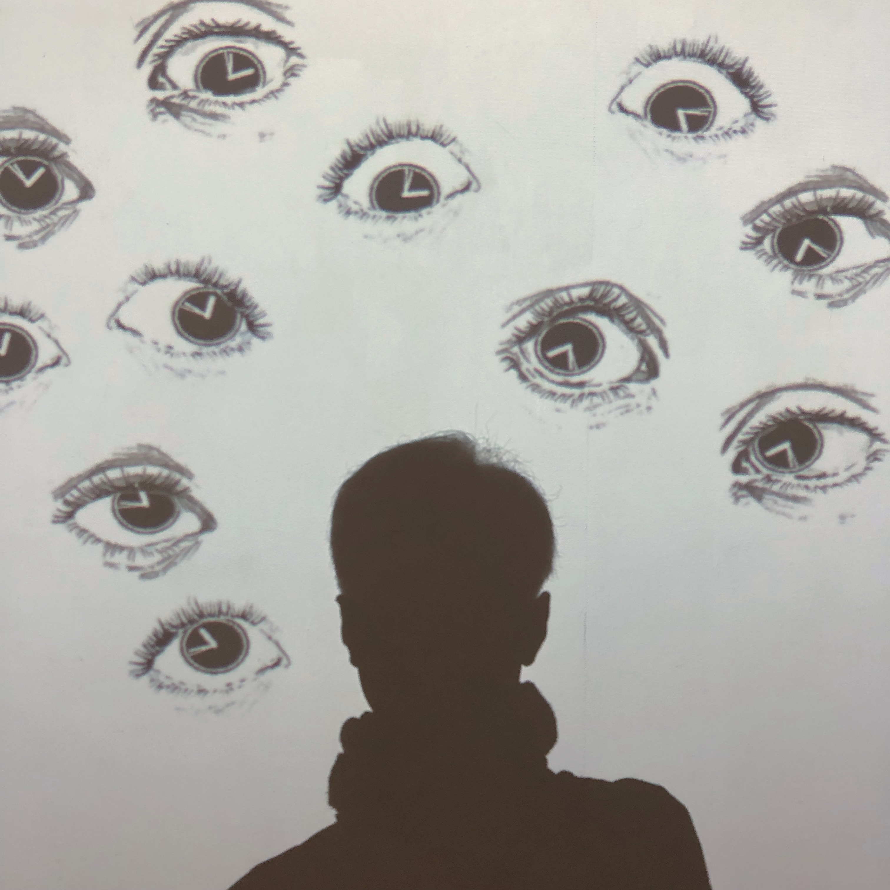

## Uncomfortable_eyes-media-art
- 기간 : 2018-08-23 ~ 2019-02-16
  - 성과 : HCI Korea 2019 학술대회 '층간笑음' 본선 출품
  - 개요 : 사회적 시선에 대한 불편함을 주제로 미디어아트 제작
  - 내용 : 관람객의 위치를 Kinect로 인식하고, 움직임에 따라 눈동자 이미지가 따라다니는 듯한 연출로 불편함을 느끼도록 기획
  - 역할 : 관람객의 위치 값에 따라 이미지를 생성 또는 삭제
  - 개발 언어, 환경 및 모델 : Processing / Processing / KinectPV2

## Video

(아래 이미지를 클릭하면, 홍보 영상을 보실 수 있습니다.)

## Demo

## 참고
프로젝트에 대한 자세한 내용은 ['불편한 시선'](https://github.com/Hongiee2/Uncomfortable_eyes-media-art/blob/master/HCI2019CreativeAward%20%EC%A7%80%EC%9B%90%EC%84%9C_%EC%84%B8%EC%A2%85%EB%8C%80%ED%95%99%EA%B5%90%20%EB%B6%88%ED%8E%B8%ED%95%9C%20%EC%8B%9C%EC%84%A0%ED%8C%80.doc)에 기록해두었습니다

